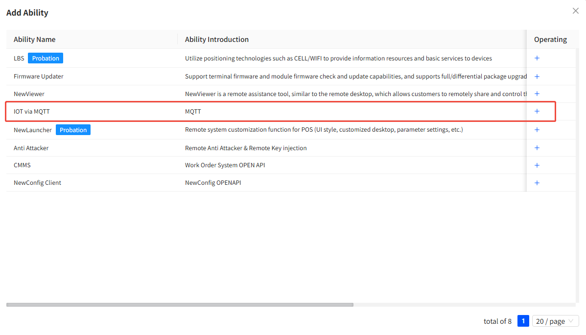
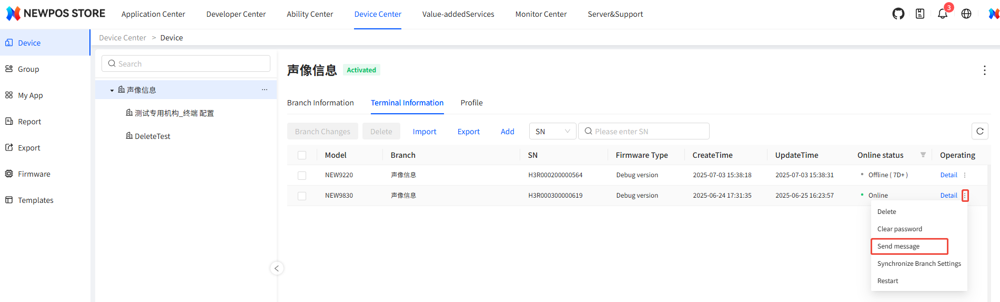
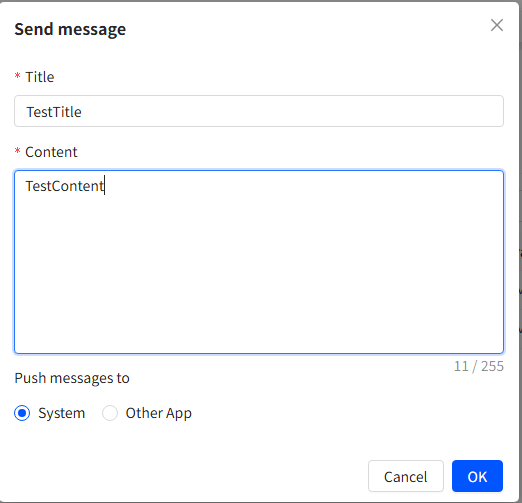
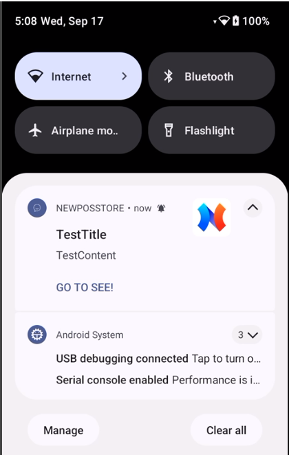
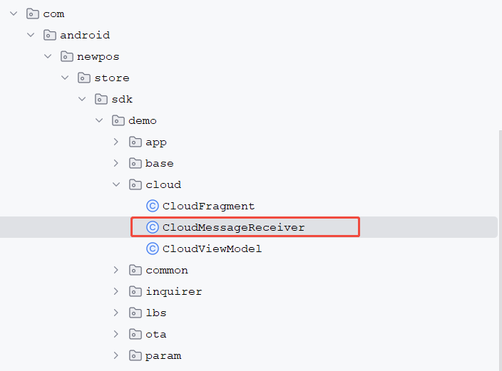
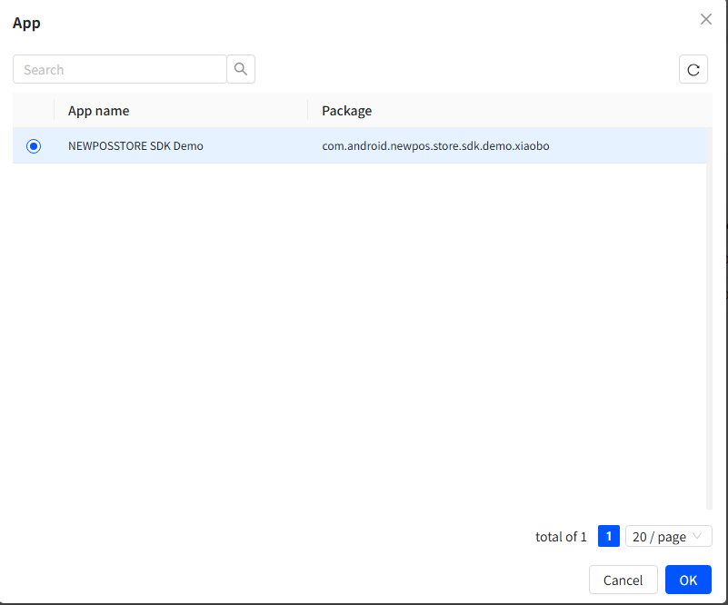
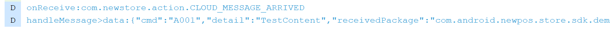
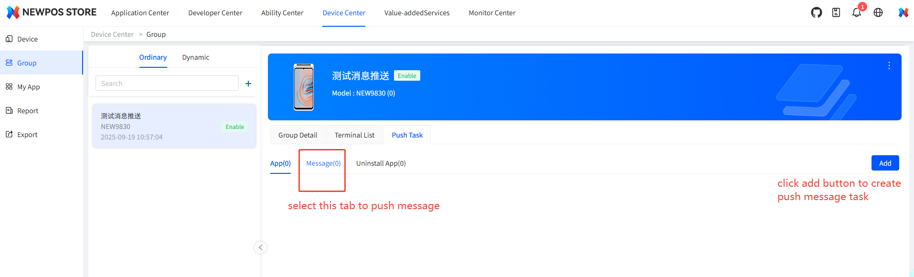

# Function Description

This function enables you to send messages to the terminals through the NEWSTORE platform.

# Integration steps

## Create capability application

Please follow the operation steps shown in the video at ./files/createAbilityApp.wmv to create the ability application.

## Add the NEWSTORE client capability to the application for capabilities.

After creating the capability application, add the  IOT capability to the capability application as shown in the following figure.

## Classification of Messages

### Push the APP to the system

Once such messages reach the terminal, a notification will be displayed in the status bar.

Click the "Detail" button of a single device on the device list page

After receiving the message, the POS will display a notification in the status bar.

### Push the APP to the designated third-party APP

#### Register a broadcast receiver

You can refer to the following files in the project sample code.

#### Push notification

When sending the message to the terminal, the target is set as "Other App". on the below  page

Select the package name of the capability application that you have created from the pop-up list box.

Then the APP will receive the messages pushed by the platform within the registered broadcast receiver.

## Multicast message

Multicast messages are used to simultaneously deliver messages to a group of terminals.

