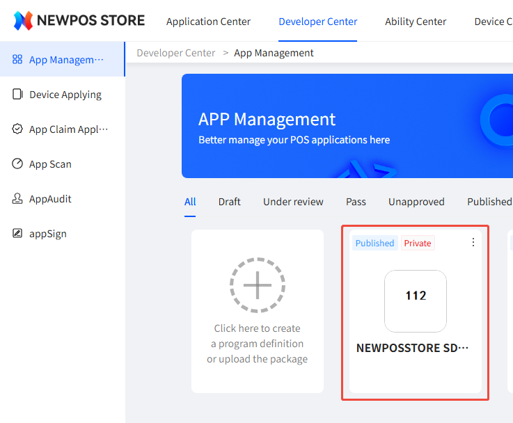
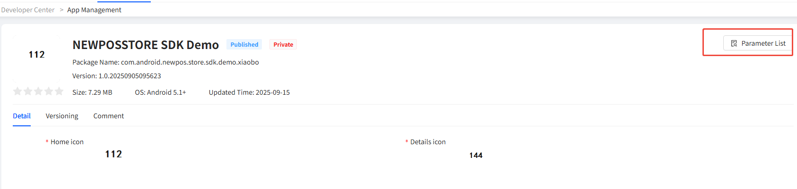
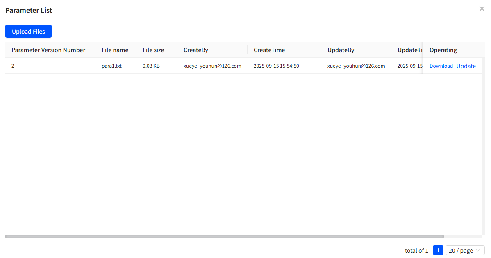
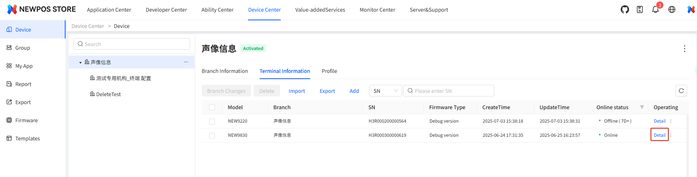
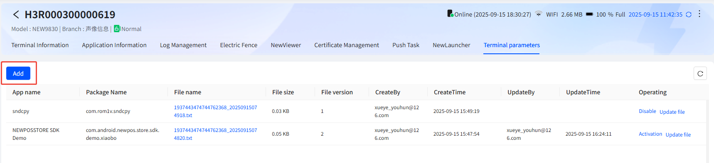
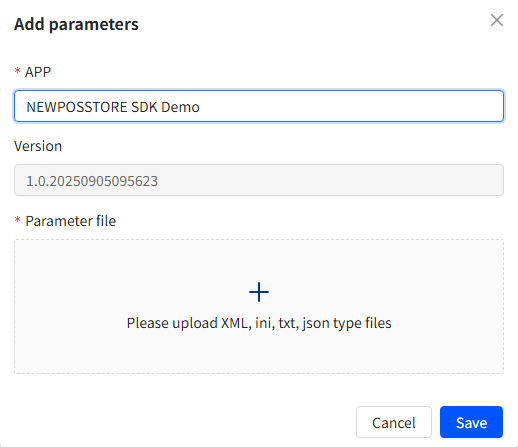
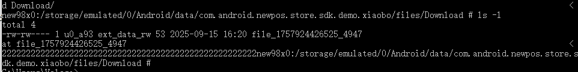

# Function Introduction

This feature enables you to transfer parameter files from the NEWSTORE platform to the terminal.

# Integration steps

## Create capability application

Follow the operations shown in the /files/createAbilityApp.wmv video in the current directory to create the ability application.

## Configure the NEWSTORE CLIENT capability


click AddAbility button


## upload App

Upload the APP to the Developer Center,as the below picture


Among the following options, select "Upload Application"


According to the requirements of the page content, complete the information upload for the APP.

# uploadParameter

## Parameter file classification

### APP-level parameters

This parameter file is bound to the APP. All terminals that have installed this APP will retrieve the same parameter file.

### Terminal-level parameters

This parameter file is not only associated with the current APP, but also with the current terminal's SN. Its level is higher than that of the parameter files of the APP. When both are configured, the terminal-level parameters will be returned first.


## Upload the parameter file at the APP level

Click on your APP in the Developer Center




Click the operation button at the top right corner of the page to upload the parameter file.




You can upload the parameter file on the following page.



## Upload the terminal parameter file

This parameter file is only applicable to the specific SN terminal. It has a higher priority than the parameter file at the APP level and will override the parameter file at the APP level.

Follow the steps below to operate.









after upload the parameter file ,click save button to take effect.

# Parameter file download SDK interface description

## Query parameter file

```java
public void queryParamFile(){
        showLoading(new LoadingOption("Querying parameter list..."));
        addSubscribe(Observable.just(true)
                .observeOn(Schedulers.io())
                .subscribe(n -> {
                    appResponseList = StoreSdk.getInstance().paramAbility().queryParamsList();
                    if(appResponseList.isEmpty()){
                        mInfo.postValue("There is no parameter file under the application. Please go to the cloud platform to upload it.");
                    }else {
                        StringBuilder builder = new StringBuilder();
                        for (AppResponse appResponse : appResponseList){
                            builder.append(appResponse.toString()).append("\n");
                        }
                        mInfo.postValue(builder.toString());
                    }
                    dismissLoading();
                }, throwable -> {
                    dismissLoading();
                    showError(throwable);
                })
        );
    }
```

## Query parameter file successful data example

```
{
    "code": "0000",
    "data": [
        {
            "attachFiles": [
                {
                    "fileSize": 26,
                    "id": 33,
                    "patchHash": "8C55D8E773DD6335DF16763191992BCBC0C8C3F16184C5C346C4510EB91E9F75",
                    "patchType": 1,
                    "patchUrl": "https://cdn.ns.newposp.com/newstore/base/apk/param/33/para1.txt?r=1967482853708345344&s=1757942139-483-9276cd9f75fdfd5b311ea1af99e81a2d7ec3c9a0&u=5&t=3&i=1937443474744762368",
                    "patchVer": 2,
                    "source": "5"
                }
            ],
            "fallback": 0,
            "packageName": "com.android.newpos.store.sdk.demo.xiaobo",
            "verCode": 1,
            "verName": "1.0.20250915161754"
        }
    ],
    "msg": "success",
    "total": 1
}
```


## Download the parameter file


```java
public void downloadParamFile(){
        showLoading(new LoadingOption("Downloading parameter file..."));
        addSubscribe(Observable.just(true)
                .observeOn(Schedulers.io())
                .subscribe(n -> {
                    if(appResponseList == null || appResponseList.isEmpty()){
                        mInfo.postValue("There is no parameter list, please query first!");
                        dismissLoading();
                        return;
                    }
                    ParamAbility paramAbility = StoreSdk.getInstance().paramAbility();
                    ParamDownloadRequest paramDownloadRequest = new ParamDownloadRequest();
                    paramDownloadRequest.setPackageName(getApplication().getPackageName());
                    paramDownloadRequest.setSaveFilePath(getApplication().getExternalFilesDir(Environment.DIRECTORY_DOWNLOADS).getAbsolutePath());
                    paramDownloadRequest.setVersionCode(1);
                    paramDownloadRequest.setSerialNumber(paramAbility.getSerialNumber());
                    ParamDownloadResponse paramDownloadResponse = paramAbility.downloadParamToPath(paramDownloadRequest, appResponseList.get(0));
                    paramDownloadResponseMutableLiveData.postValue(paramDownloadResponse);
                    dismissLoading();
                }, throwable -> {
                    dismissLoading();
                    showError(throwable);
                })
        );
    }
```

Example of successful download of parameter file



