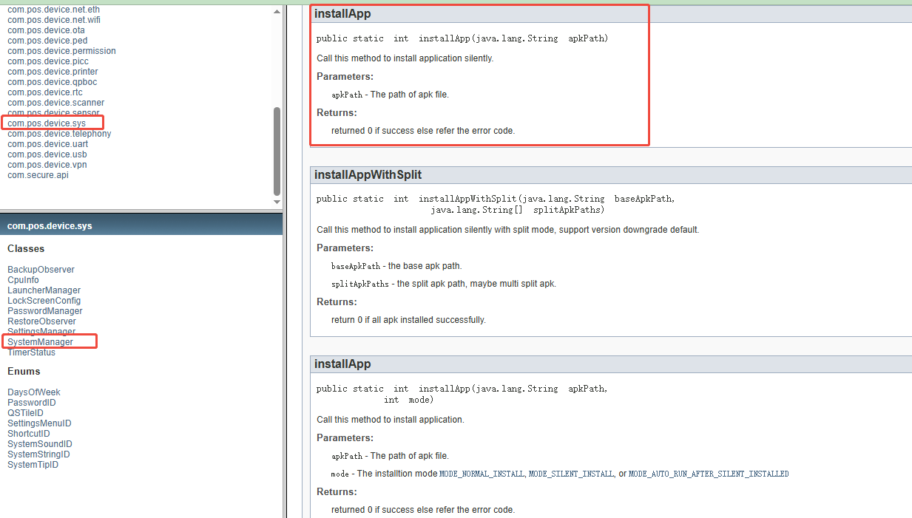

# Function Introduction

This function provides relevant interfaces, allowing you to query information about related apps from the newstore platform as needed, including download installation package links, etc. It also provides a download interface for you to download APK installation packages and enables you to independently control the update strategy of the apps.

# Integration steps

## Create capability application

Please follow the steps described in the "files/creatAbilityApp.wmv" video in the current directory to create the ability application.

## Bind the NewStoreClient capability for the APP

After creating the capability application, add the following capabilities to the application


# Interface Introduction

```java
public List<StoreApp> getStoreApps(List<String> packageNameList) throws BaseException {}
```

- Interface Function Description

This interface enables you to input a list of application package names, and then it will return the information about the corresponding apps to be queried.

- Call Example

```java
public void getAppsByPackageName(){
        showLoading(new LoadingOption("Loading apps..."));
        addSubscribe(Observable.just(true)
                .subscribeOn(Schedulers.io())
                .observeOn(Schedulers.io())
                .subscribe(b -> {
                    List<String> packList = new ArrayList<>();
                    packList.add("com.desert.android.appping");
                    packList.add("com.google.android.apps.googleassistant");
                    List<StoreApp> storeApps = StoreSdk.getInstance().appAbility().getStoreApps(packList);
                    if(storeApps == null || storeApps.isEmpty()){
                        throw new BaseException("No application found");
                    }

                    List<AppDownloadStatus> appDownloadStatuses = new ArrayList<>();
                    for (StoreApp storeApp : storeApps){
                        AppDownloadStatus downloadStatus = new AppDownloadStatus();
                        downloadStatus.storeApp = storeApp;
                        downloadStatus.pack = storeApp.packageName;
                        downloadStatus.downloadStatus = DownloadStatus.START;
                        downloadStatus.percent = "0%";
                        appDownloadStatuses.add(downloadStatus);
                    }
                    appList.postValue(appDownloadStatuses);
                    dismissLoading();
                }, e -> {
                    dismissLoading();
                    showError(e);
                })
        );
    }
```

An example of successful interface call is as follows

```java
{
    "code": "0000",
    "data": [
        {
            "apkSignType": "0",
            "appDefId": 131,
            "appFile": "https://cdn.ns.newposp.com/newstore/base/apk/1971146075017666560/893fc6f289c8fbbd5042a31f77366376_1731644964465.apk?r=1857313609242296320&s=1759223456-596-44b78a7b5a5c390c01fec511d0a634cef0142a36&u=1&t=3&i=1940676455017570304",
            "appHash": "e69001aa0271c6da5cdc1e27b7057816aef6e80897edca216ac5a3a684900d15",
            "appId": 1857313609242296320,
            "appSimpleDesc": "The obtained information data is very detailed and the query speed is fast, detected by ping servers from multiple locations.\nIt can detect website parsing time, server connection time, download speed, GZIP status, etc.\nSuper compact, only about 40KB in size, and the interface has no advertisements.\nFree and easy to operate, just enter the website or domain name you want to query.",
            "appSize": 2245872,
            "areaDescription": "System Tools",
            "basedOn": "Android 5.0.1",
            "cid": 8888,
            "createTime": 1731653046000,
            "developer": "newstore_test@newpostech.com",
            "downCount": 84,
            "fallback": 0,
            "feeType": "0",
            "iconFile": "https://cdn.ns.newposp.com/newstore/base/img/2894ff0a6385da5c6d26a669b7c772ca_1731653083318.png",
            "innerSignId": 853,
            "minSdkVersion": 21,
            "packageName": "com.desert.android.appping",
            "partnerFullName": "NEW POS TECHNOLOGY LIMITED",
            "partnerType": "1",
            "permsAndroid": [
                "DYNAMIC_RECEIVER_NOT_EXPORTED_PERMISSION",
                "INTERNET"
            ],
            "progName": "Ping+",
            "screenShots": [
                "https://cdn.ns.newposp.com/newstore/base/img/fa9b3ce78879e15e0d5d51fda524a0c4_1731653162491.png",
                "https://cdn.ns.newposp.com/newstore/base/img/dcaa36b4898d08d5c1ac15284482ea53_1731653170279.png",
                "https://cdn.ns.newposp.com/newstore/base/img/5ee478117be839417651077fe74003eb_1731653176345.png"
            ],
            "signType": "2",
            "starValue": 4,
            "subscribeSignId": 1971146075017666560,
            "verCode": 1,
            "verName": "1.0"
        },
        {
            "apkSignType": "0",
            "appDefId": 156,
            "appFile": "https://cdn.ns.newposp.com/newstore/base/apk/1971145988866662400/de1070de7eb796126e73432a6d240689_1732084376618.apk?r=1859122741312405504&s=1759223456-342-ece01d6d3361a52afafc1251a73194825d81e35f&u=1&t=3&i=1940676455017570304",
            "appHash": "b73d846bca46168edeb0e52bbb075a58c110b4750a4fda2841a31027fb975c00",
            "appId": 1859122741312405504,
            "appSimpleDesc": "Google Assistant is an easy way to use your phone and apps, hands-free\nSave time and get more done with a little help from Google. Set reminders and alarms, manage your schedule, look up answers, navigate and control smart home devices*, and much more hands-free.\n\n*Compatible devices required",
            "appSize": 1226557,
            "areaDescription": "Employee Management/Customer Management/Travel/Finance",
            "auditNote": "Google Assistant is an easy way to use your phone and apps, hands-free\nSave time and get more done with a little help from Google. Set reminders and alarms, manage your schedule, look up answers, navigate and control smart home devices*, and much more hands-free.\n\n*Compatible devices required",
            "basedOn": "Android 5.0.1",
            "cid": 8888,
            "createTime": 1732084377000,
            "developer": "newstore_test@newpostech.com",
            "downCount": 663,
            "fallback": 0,
            "feeType": "0",
            "iconFile": "https://cdn.ns.newposp.com/newstore/base/img/220bce7702a893871b817b329568fb76_1732084385237.png",
            "innerSignId": 854,
            "minSdkVersion": 21,
            "packageName": "com.google.android.apps.googleassistant",
            "partnerFullName": "NEW POS TECHNOLOGY LIMITED",
            "partnerType": "1",
            "permsAndroid": [
                "READ_GSERVICES",
                "ACCESS_NETWORK_STATE",
                "GET_PACKAGE_SIZE"
            ],
            "progName": "Assistant",
            "screenShots": [
                "https://cdn.ns.newposp.com/newstore/base/img/89949fa1a856826373ff92db4378b588_1732084415483.png",
                "https://cdn.ns.newposp.com/newstore/base/img/d2551b65dc371169dcaee859484feae7_1732084417486.png",
                "https://cdn.ns.newposp.com/newstore/base/img/171d42f0fe33bf2ae6450a8cc00b9679_1732084419480.png",
                "https://cdn.ns.newposp.com/newstore/base/img/55240e35aeb6eef507619cb7ba110ef9_1732084421432.png",
                "https://cdn.ns.newposp.com/newstore/base/img/b7be999563d89a44b49befa61505c5fc_1732084423402.png"
            ],
            "signType": "2",
            "starValue": 3,
            "subscribeSignId": 1971145988866662400,
            "verCode": 60,
            "verName": "0.1.601924805"
        }
    ],
    "msg": "success",
    "total": 2
}
```

After obtaining the CDN link address of the file, you can proceed with the download of the related APP. Of course, download examples are also provided in the current project for reference.

```java
public StoreApp checkForUpdate(String packageName) throws BaseException {}
```

- Interface Function Introduction

This interface is used to check whether there is a new version of the installed APP on the TMS.

Note: The package name passed in here must be the one that has already been installed on the current machine.

- Call Example

```java
public void checkForUpdates(String packageName){
        showLoading(new LoadingOption("Checking for updates..."));
        addSubscribe(Observable.just(true)
                .subscribeOn(Schedulers.io())
                .observeOn(AndroidSchedulers.mainThread())
                .subscribe(b -> {
                    StoreApp newApp = StoreSdk.getInstance().appAbility().checkForUpdate(packageName);
                    if(newApp == null){
                        throw new BaseException("check failed!");
                    }
                    Toast.makeText(getApplication(),
                            getApplication().getString(R.string.start_download, newApp.toString()),
                            Toast.LENGTH_SHORT).show();
                    dismissLoading();
                }, e -> {
                    dismissLoading();
                    showError(e);
                })
        );
    }
```


## Install the APP

Our POS provides a hardware operation SDK, and the file name is sdk.jar. You can use the installation interface in this SDK to install the APP. The location of the interface is shown in the following figure.

