# RKI Function Introduction

RKI allows applications to conveniently download key information from the NEWPOS RKI platform and transfer it to the POS.

# Steps for connecting to the RKI service

## POSEquipment environment inspection

POS needs to install the NEWPOS RKI service APP. The version should be 1.2.250822 or higher. This service will be pre-installed when the device is manufactured.

The intelligent POS device needs to have the RKI certificate pre-installed. The specific procedure is as follows: Click to open the DeviceConfig App on the POS device, check the status of the RKI. If the prompt reads "Valid Certificates", it indicates that it is supported.

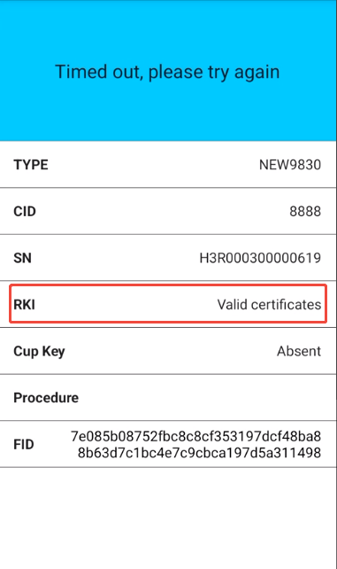

## Enable the RKI function on the NEWSTORE platform

Apply to activate the RKI function

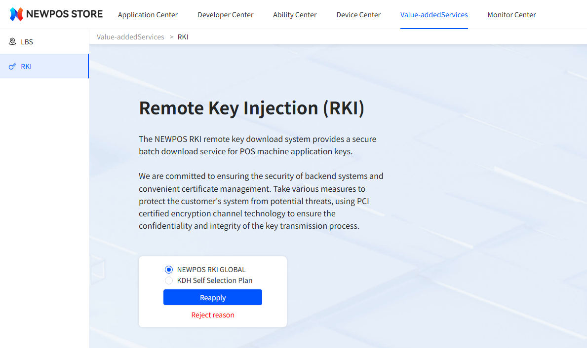

After submitting this application, it will be reviewed by the NEWSTORE operation staff.

### Add RKI capabilities to the application of abilities

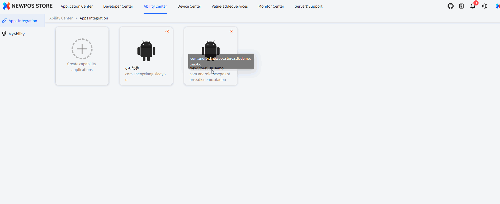

Description of key methods supported by the RKI platform

- Named

  The key for the naming method needs to be provided by the customer first through courier or email to the NEWPOS key administrator. The key transmission component will then be written into the encryption machine by the key administrator. Subsequently, the customer's newstore operation staff will import the key into the RKI encryption machine through the key file. At this point, the key in the key file has been encrypted and protected by the transmission key.

- Anonymous

​	The anonymous key is the key information that the customer inputs on the page. The result obtained after performing an XOR 	operation on the input components is the key to be written into the POS.

## Example of Anonymous Key Import

Please refer to the attached image for the upload of the anonymous key.

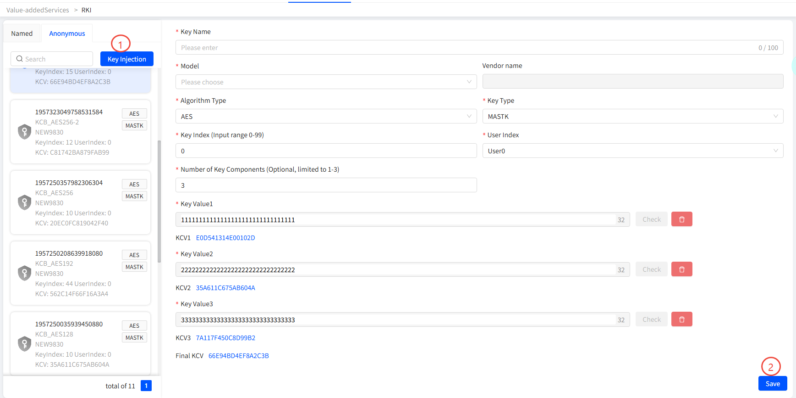

After clicking the "Save" button, a batch record of keys will be generated. Once the data synchronization is completed, the key information can be deployed to the terminals.

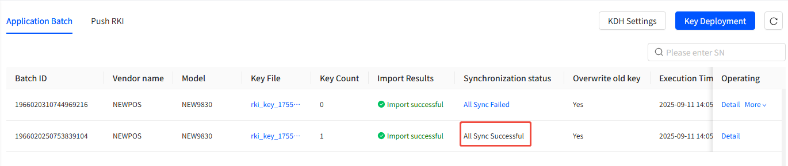

## Example of Named Key Import

The process of importing anonymous keys is rather complicated, involving key transmission configuration, generation of key file formats, etc. Offline communication and confirmation are required. This will not be elaborated here.

## The RKI interface description in the NEWSTORE SDK

### Bind to the RKI service

``

```
public boolean bindRkiService() {
    Context context = BaseApi.getInstance().getContext();
    Intent intent = new Intent("com.newpos.rki.core.rkiservice");
    intent.setPackage("com.newpos.rki");
    boolean bind = context.bindService(intent, this.connection, 1);
    BaseLog.d("bindRkiService result:" + bind);
    return bind;
}
```

### Query KDH Infomation

``

```
public QueryKdhurlResponse getKdhUrl(QueryKdhurlRequest queryKdhurlRequest) throws BaseException {
    
}
```

### DownloadCustomerKey

``

```
public RkiCode downloadCustomerKeys(String clientId, String kdhUrl, String messageId, final IRkiCallback callback) {
   
}
```

The parameter description of this function

- String clientId

  After creating a key on the NEWSTORE platform, it will generate a code which is used to identify a set of key information.Just take the corresponding value in the red box.

  For the anonymous key, the corresponding client ID is as follows

  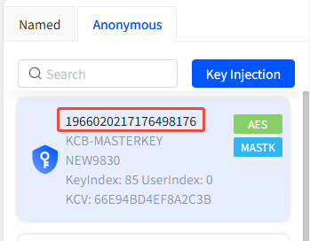

  The client ID for the naming key is as follows

  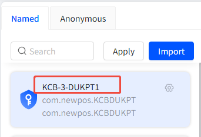

  ***Caution: This parameter is extremely important. It must be configured correctly; otherwise, the key will not be downloaded successfully.***

- String kdhUrl

  The kdhUrl provides information about the encryption machine and can be directly obtained from the newstore platform.

  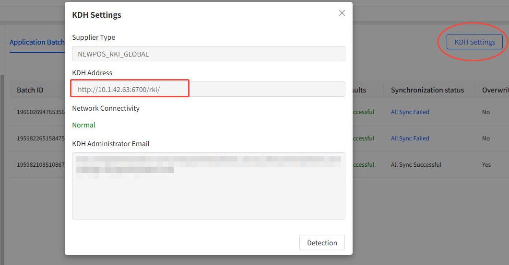

-  String messageId

  This parameter is used to notify the server of the update status of the key download during the push key download callback process. If the POS initiates the key download operation actively, this value can be set to null.

-  final IRkiCallback callback

​	This callback is used to inform the download result of the key.	

## Download key

### The POS terminal initiates the active download. 

After completing the key configuration on the Newstore platform, you can call the DownloadCustomerKey interface in the application.

### Push the key to the POS through the NEWSTORE platform

#### Register the client ID

When initializing the SDK, you need to refer to the following code to register the client ID obtained from the Newstore platform to the backend.

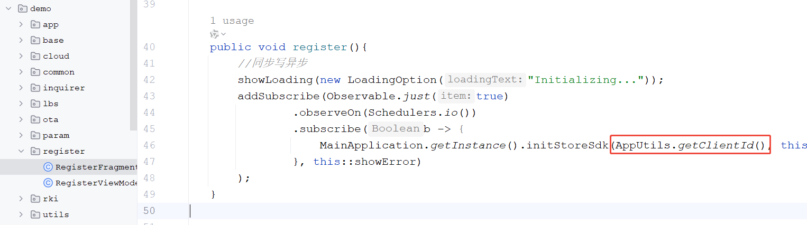

#### Implement the key download function

Refer to the sample code. Register a broadcast receiver for capability application, and perform the key download operation after receiving the push message. The sample code is as follows.

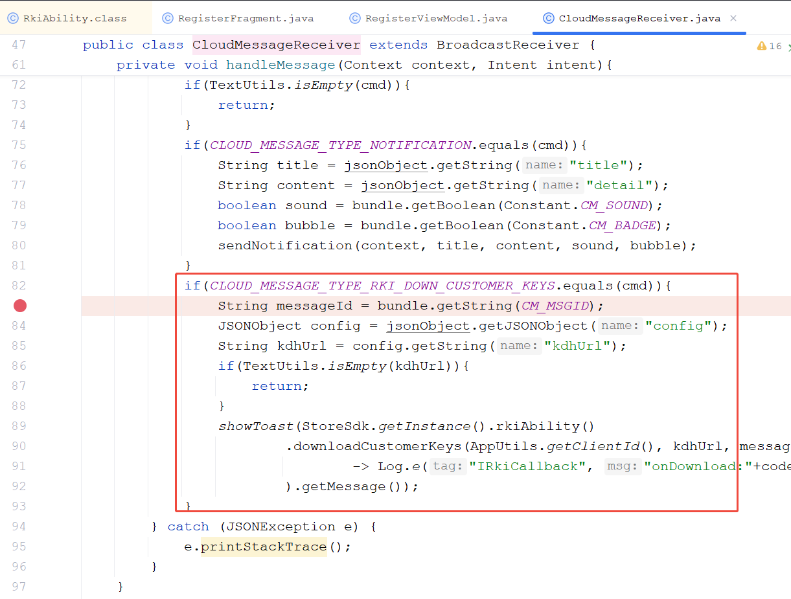

#### Push the key to the platform end

To perform key push on the NEWSTORE platform, the operation example is as follows

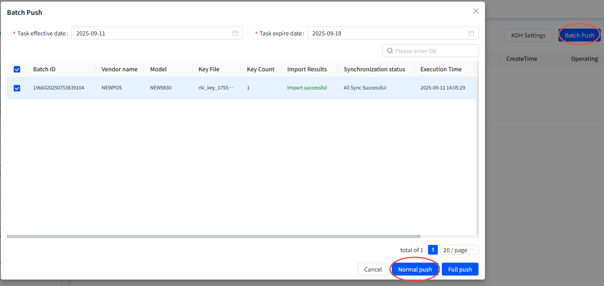

#### Check the push key download results

Click the "detail" button on the rightmost side of the push notification to view the download results of the key push.

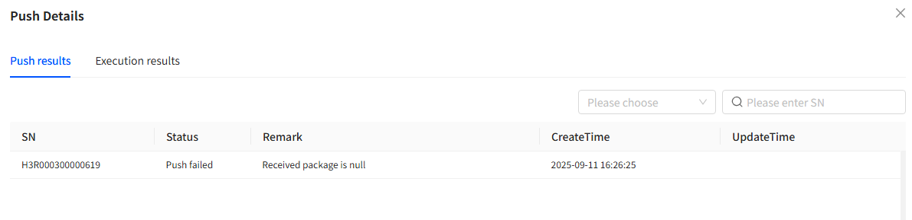

